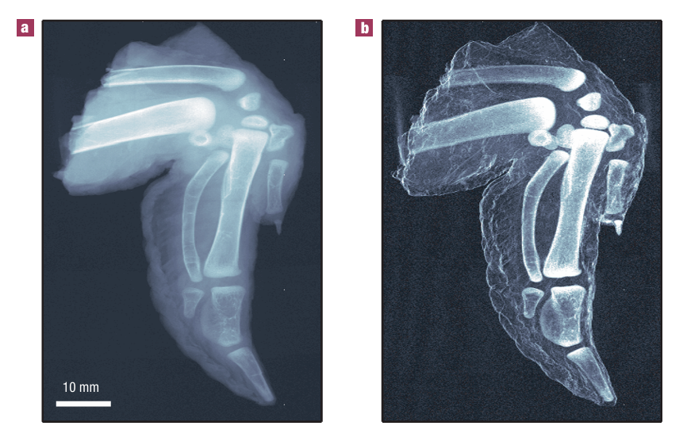
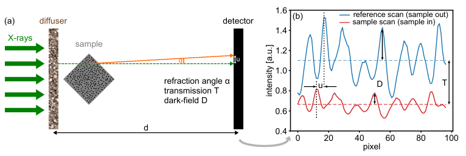

Introduction

Over the last five decades of the 20th century, the principles of phase-contrast imaging have successfully been applied to X-ray regime, leading to significan applications applications in biomedical and clinical imaging, but also in material science. The key advantage of this method is its sensitivity to subtle differences that are often undetectable with classic absorption methods. However, since X-ray detectors can only measure the intensity of X-ray—not phase—methods were developed to convert phase shifts into measurable intensity differences. Among them, X-ray speckle-based imaging and grating-based imaging allow to reconstruct not only the phase-contrast signal, but also the dark-field image.

Grating-based imaging

The development of contrast mechanisms in hard X-ray imaging, such as dark-field and phase contrast, has emerged only recently. Recording the phase shift, in addition to adsorption can significantly enhance image contrast, allowing the detection of subtle structural variations.
In grating-based imaging, two gratings are required: a phase grating G1 and an absorption grating G2. G1 is similar to a beam splitter: it splits the beam into the first two diffraction orders which, subsequently, interfere. If they are then illuminated, they form a periodic fringe pattern whose position is converted into intensity modulations by the absorption grating G2, placed immediately before the detector plane. In this way one can obtain information about the phase gradient of the object. To achieve this, the two gratings must be positioned at a specific distance given by the following formula:

d_m=(m-1/2)  〖g_1〗^2/4λ         m=1,2,3…

because of the Talbot effect. By scanning one grating along the transverse direction xg, an image is taken for each scan. The intensity at each pixel I(x,y) oscillates as a function of xg. Through the analysis of the phase of these oscillations, by using a one-dimensional integration, the phase profile of the object can be retrieved. The phase is indeed related to the wavefront phase profile, the wavelenght of X-rays, the distance between the two gratings and the period of the absorption grating by the following relation: 

φ=λd/g_2   δϕ/δx

Furthermore, from the tomographic reconstuction of wavefront phase profile Φ taken at different viewing angles, the three-dimensional distribution of the reflective index of the object can be obtained.
Despite these advances, these types of imaging still require a highly brilliant synchrotron radiation source to be carried on. 
To address this, F. Pfeiffer et al. developed a novel approach for dark-field imaging that allows to use conventional X-ray sources and provides new and unique structural informations about the specimen. Their experimental setup incorporates a third grating. The first grating G0 is placed right after the X-ray source and creates a series of spatially coherent, periodically repeating line sources, making phase-contrast imaging feasible with a standard X-ray setup. Phase contrast image is then formed by combing G1 and G2. G1 is the grating that creates phase modulations in the incoming wave field. These are translated into intensity modulations through the Talbot effect in the plane of G2, which is placed before the detector. The result is a linear fringe pattern on the detector plane. By moving one of the gratings along the transverse direction xg, the intensity I(m,n) at each pixel (m,n) oscillates and the changes in I(m,n,xg) caused by placing a specimen are trasnformed in several imaging signals, including dark-field contrast. The oscillations of the intensity for each pixel can be written in a Fourier series: 

I(m,n,x_g )= ∑_i▒〖a_i (m,n)cos⁡(ikx_g+ϕ(m,n)  ≅ a_o (m,n)+a_1 (m,n)cos⁡(kx_g+ ϕ_1 (m,n))〗

From the phase term Φ1 in the previous equation it is possible to obtain several phase-contrast images. On the other hand the first component of the Fourier series contains information about the scattering power of the specimen. 
The validity of the approach is demonstrated by imaging a chicken wing. As can be observed by comparing Figure 1(a) and 1(b), the dark-field image produces boundaries and interfaces much more visible compared to the classic transmission image.

Patterned illuminations

X-ray speckle-based imaging relies on the interaction of coherent X-rays with an object formed by random distributely scatterers such as membranes or pieces of sand paper. When the coherent light impinges on the diffuser, a speckle pattern is formed in the detector plane. This pattern serves as the reference. Then, when the sample is inserted into the beam, the speckle pattern is altered as a consequence and the new pattern is recorded. Specifically, the speckles are displaced due to refraction in the sample and the visibility of the pattern decreases due to small angle scattering from unresolved features. By comparing reference and modified pattern, information about the refractive index, the transmission and the dark-field signal can be obtained.

The first application of X-ray speckle based imaging was in the so-called X-ray speckle-tracking mode (XST). XST offers a major advantage over methods like grating interferometry: it requires only two images—one reference image without the sample and one with the sample—making the phase reconstruction process significantly simpler and faster. However, high order modulations of the signal with the sample are neglected, although they contain other useful information such as the local curvature of the wavefront. 
The reconstruction of the refraction signal is retrieved by selecting an analysis window around each pixel and then making a cross-correlation between the same window with and without the sample. Transmission signal (T) and dark-field image (D) are obtained from the mean intensities in the sample window (I ̅) and the reference window (I ̅_0):

T=  I ̅/I ̅_0 
D=  1/T  ∆I/(∆I_0 )

A key limitation of this implementation is the low spatial resolution. To address this problem, several techniques have been proposed, among which there is the Unified Modulated Pattern Analysis (UMPA). In this approach, images are recorded at different random diffuser positions. The interference pattern of the sample can be described as the modulated reference pattern by the followinf formula:

I(x,y)=T(x,y)[I ̅_0+D(x,y)(I_0 (x+u_x,y+u_y )-I ̅_0]

Where T represents the local transmission through the sample, D is the dark-field signal and ux and uy represent the displacement of the interference pattern in horizontal and vertical directions. The minimization of the function L here runs also on all the diffuser position n. This approach allows to reduce the spatial resolution because the size of the analysis window is only few pixels.

