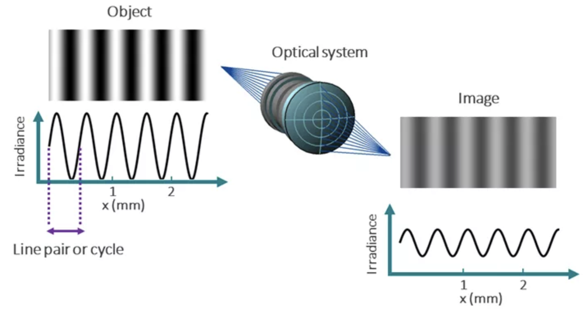

# The Role of Quantum Efficiency, Noise, and Modulation Transfer Function in X-ray Detection

## Introduction

In X-ray imaging, achieving high-quality images is essential for accurate diagnosis and analysis. Several factors play a role in the performance of an X-ray detection system, for example system’s quantum efficiency, noise, and the modulation transfer function.

These three parameters are deeply interconnected, as each plays a critical role in determining the image quality, resolution, and contrast of the resulting X-ray image.

## 1. Quantum Efficiency in X-ray Detection

Quantum efficiency (QE) is the ability of a detector to convert incoming X-ray photons into an electrical signal. It is defined as the ratio of the number of detected photons to the number of incident photons striking the detector. A high QE indicates that the detector is efficient in capturing X-ray photons and producing a meaningful signal, which directly impacts the signal-to-noise ratio (SNR) and image quality. It can be expressed mathematically as:

$$
QE = \frac{\text{Number of detected photons}}{\text{Number of incident photons}}
$$

Several factors can play a role in determining the QE of an X-ray detector:

- **Material properties:** the composition of the detector material determines how effectively it absorbs and converts X-rays.
- **Energy dependence:** QE is often energy dependent, for example higher energy X-rays are typically harder to detect, resulting in lower efficiency.
- **Detector design:** thickness of the sensing layer, pixel size and type of readout mechanism can affect the overall QE.

## 2. Noise in X-ray Detection

### 2.1 Types of Noise

The main goal of an X-ray detector is to obtain high-quality images in which true information is distinguished from background fluctuations. This aim could be hampered by **Noise**, which refers to any unwanted variation in the signal that can create an unclear image.

There are several noise sources that can impact the quality of X-ray images:

- **Quantum Noise (Poisson Noise):** This is statistical noise caused by the discrete nature of X-ray photons. It results in random fluctuations in the number of incoming photons detected by each pixel, leading to signal variability. Quantum noise is typically more pronounced at low photon counts, where the number of photons may be insufficient to produce a clear image.
- **Electronic Noise:** This noise originates from the electronic components of the detector and processing system such as amplifiers and analog-to-digital converters. Therefore, electronic noise is present even in the absence of X-ray photons and contributes to the overall noise level.
- **Thermal Noise:** Thermal noise occurs due to random fluctuations in the movement of charge carriers within the detector material, which is usually driven by changes in temperature.
- **Detector-Related Noise:** This includes noise introduced by imperfections in the detector's material and structure, such as defects in the pixel array or inefficiencies in photon conversion, which can lead to additional noise.

### 2.2 Signal-to-Noise Ratio (SNR)

Image quality in X-ray imaging is evaluated by means of the signal-to-noise ratio (SNR). It is defined as the ratio of the signal strength (i.e., the useful image information) to the noise level (unwanted random fluctuations):

$$
SNR = \frac{\text{Signal}}{\text{Noise}}
$$

In medical imaging, for example, improving SNR is crucial to ensure that small details, such as lesions or fractures, are visible even in noisy or low-dose scans. Balancing SNR with dose is a critical aspect for X-ray imaging systems optimization.

## 3. Modulation Transfer Function in X-ray Detection

Modulation Transfer Function (MTF) is a performance indicator that evaluates the loss of contrast in an image relative to the object. When light from an object passes through an optical system, it is focused to create an image. However, imperfections in the system, such as lens distortion, vignetting or diffraction, can cause image contrast degradation as the spatial frequency increases. A simple example of contrast damage is shown in Figure 1.

  
*Figure 1: Degradation of contrast in the image relative to the object due to optical system. [1]*

Spatial frequency is usually expressed in line pairs per millimeter (lp/mm) and refers to the rate at which intensity patterns (light and dark regions) change in space. Low spatial frequencies represent large details in an object while high spatial frequencies represent finer details.

MTF is usually represented as a plot: on the y-axis there is the transfer contrast from 0 (no contrast transfer) to 1 (perfect contrast transfer), and on the x-axis the spatial frequencies (from low to high values). High MTF at higher spatial frequencies means that the system can clearly resolve fine details in the object being imaged. An example of an MTF graph is shown in Figure 2.

  
*Figure 2: Example of the Modulation Transfer Function as a function of the frequency. [2]*

### 3.1 How to Measure MTF in an Optical System

There are several methods to measure MTF in X-ray systems, each capturing the system’s response to a known input pattern and then analyzing the output image. Below, the Edge Spread Function (ESF) method is shown. In this approach, a sharp edge (such as a thin metal edge) is imaged and the resulting image is analyzed.

When a point object is imaged, a blurred representation appears. Blurring is described by the Point Spread Function (PSF) and is due to imperfections related to the imaging system such as imperfections in the X-ray source or detector, diffraction effects, and lens aberrations. Therefore, when an edge object is acquired, a blurring effect appears at the boundaries, as shown in Figure 3.

  
*Figure 3: Difference between an ideal Edge image and a real Edge image due to the imaging system. [3]*

If we focus on the blurred area and take a profile, the Edge Response (ER) is obtained (left side of Figure 4). If we take the derivative, we are able to understand how fast ER changes as a function of distance; this function is called the Line Response (LR). If we take the Fourier Transform of the LR, the Modulation Transfer Function (MTF) is obtained as a function of the spatial frequencies (lp/mm) [3].

  
*Figure 4: Scheme of the steps to obtain the Modulation Transfer Function starting from the Edge Response.*

---

## References

[1] https://www.synopsys.com/glossary/what-is-modulation-transfer-function.html#:~:text=The%20Modulation%20Transfer%20Function%20(MTF,increasingly%20harder%20for%20an%20observer.  
[2] https://howradiologyworks.com/x-ray-resolution/  
[3] https://www.youtube.com/watch?v=s7Cwg8gCGBs
